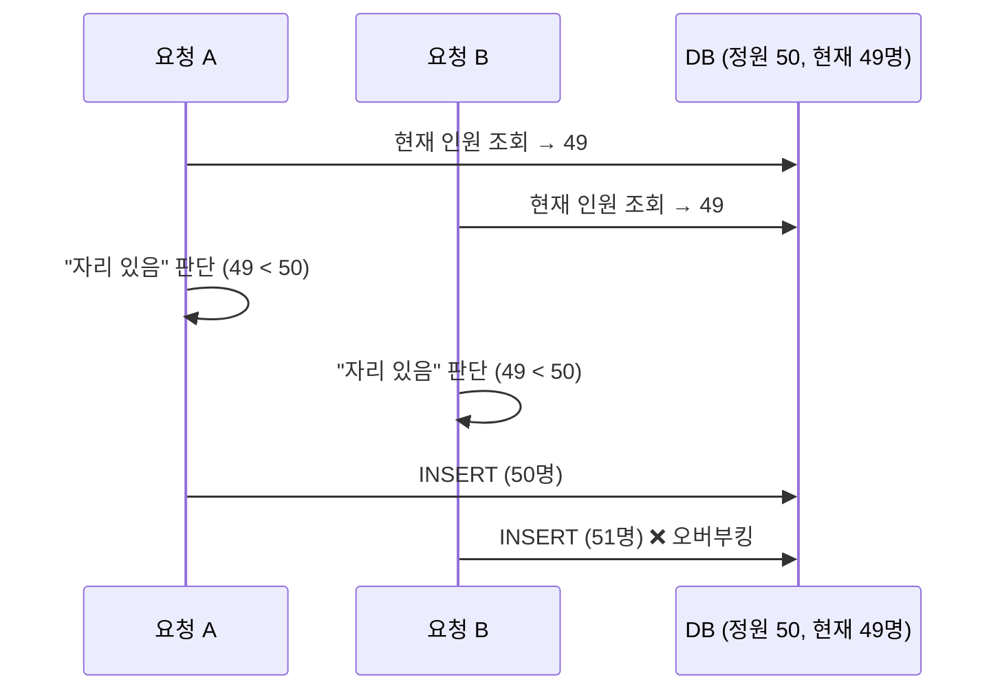

## 들어가며

이 글은 신입 시절 담당했던 프로젝트에서 마주한 `수강신청 오버부킹 동시성 문제`를, `synchronized` → `BlockingQueue` → `SELECT FOR UPDATE`를 차례로 적용하며 해결하려 했던 시행착오의 회고입니다.  
특정 방법이 정답이라는 이야기라기보다, 제한된 레거시 환경에서 어떤 시행착오를 거쳤고, 무엇을 배웠는지를 정리한 글에 가깝습니다.

> **용어 정리**
> - **오버부킹**: 수강신청 정원을 넘는 인원이 수강신청 되는 것
> - **교차신청**: 이미 신청한 강좌를 취소하면서 동시에 다른 강좌를 신청하는 기능
> - **후보자(대기자)**: 정원이 찬 강좌에 대기 상태로 등록된 사용자. 앞선 승인자가 취소하면 자동으로 승인자로 올라감
{: .prompt-info }

> 이번 글의 코드는 실제 프로젝트 코드가 아닌, 흐름을 설명하기 위해 간단하게 작성한 의사코드입니다.
{: .prompt-warning }

---

## 동시성 문제 상황

동시성 문제가 발생한 홈페이지는 평소에는 일일 접속자 수 **약 100명**, 최대 동시 접속자 수 **대략 50명**정도 였습니다.
그런데 수강신청이 시작되는 순간, **10분 동안 최대 2,000명**이 동시에 몰렸습니다. 평소의 약 **20~40배**의 `트래픽 스파이크`가 발생했습니다.

이때 정원 **50명**짜리 강좌에 **60명이 승인**되는 등 `수강신청 오버부킹`현상이 발생했습니다.
특히 교차신청 기능이 추가된 이후에 **기존 강좌 취소 → 신규 강좌 신청 → 후보자 자동 승인** 로직이 함께 실행되면서, 특정 상황에서 정원보다 많은 인원이 승인되었습니다.

동시 접속자 수 2,000명이라는 숫자 자체가 대규모 트래픽은 아니지만, 이 문제의 본질은 트래픽의 크기가 아닌, **"정원 초과는 발생하면 안 된다"는 정합성** 이었습니다. 동시성 버그는 요청이 아무리 적어도, 단 두 개의 요청만 겹쳐도 발생할 수 있기 때문입니다.

이떄 처음으로 동시성 문제를 접하였고, 해결하고자 여러가지 방법을 시도해 보았습니다.

그때 상황을 이미지로 나타내면 아래와 같습니다.
정원이 50명인 강좌에 49명이 등록된 상태에서, 여러 요청이 거의 동시에 들어오면 다음과 같은 일이 벌어집니다.



두 요청 모두 조회 시점에는 "자리가 남아 있다"고 판단하지만, 실제 등록 시점에는 둘 다 승인되어 정원을 넘겨버립니다. 인기 강좌일수록 이 경합이 같은 Row에 집중되기 때문에 문제가 더 심해졌습니다.

---

## 프로젝트 구조

자세한 시행착오를 설명하기에 앞서, 수강신청 동시성 문제가 발생한 프로젝트의 서버 구조는 아래와 같습니다.  
수강신청 동시성 문제가 발생한 프로젝트는 **WEB 서버 2대, WAS 서버 2대**로 구성되어 있었고, 각 WAS 서버에서 Spring Boot 애플리케이션 컨테이너가 **2개씩** 실행되고 있었습니다.
즉, 총 **4개의 Spring Boot 인스턴스**가 요청을 처리했고, DB는 **Oracle**을 사용했습니다.

또한 모든 서버는 `On-premise`환경이었기 때문에 서버의 추가적인 스펙업을 한다거나, Redis를 추가로 사용하는 등의 조치가 어려웠습니다.

그리고 이 홈페이지 자체가 최초 구축된 이후 10년정도 지났으며, 구축 당시 시스템은 **동시에 많은 요청이 몰리는 상황을 고려하지 않은 설계**였습니다.  
이전까지는 트래픽이 적어 문제가 발생하지는 않았지만, 사용자가 점차 증가함에 따라서 동시성 문제가 발생하게 되었습니다.  
트래픽이 줄어드는 수강신청 시작 10분 이후에는 문제가 없었기 때문에 평소의 20 ~ 40배에 달하는 요청이 **순간적으로, 그것도 인기 강좌 몇 개에 집중되어** 들어왔다는 점이 문제였습니다.


여기서 중요한 점은, **각 컨테이너가 별도의 JVM 프로세스로 실행되기 때문에 메모리를 공유하지 않는다**는 것입니다.
따라서 이후에 시행착오들에서 사용하는 Java 애플리케이션 내부의 `synchronized`, `BlockingQueue`, `Map` 같은 객체는 **컨테이너별로 독립적으로 생성**된다는 것 입니다.

---

## 시도 1 — `synchronized`

첫 번째로 시도한 방법은 수강신청 메소드 전체를 `synchronized`로 묶는 것이었습니다.
단일 JVM 내부라면 `synchronized`를 통해 동시에 하나의 스레드만 임계 영역에 진입하도록 제한할 수 있습니다.

```java
synchronized 수강신청(강좌, 사용자_아이디){
    사용자_정보 = 사용자_조회(사용자_아이디);    
    if(!수강신청_권한){
        return;
    }

    현재인원 = 조회(강좌);
    if(현재인원 < 정원){
        등록(강좌, 사용자_정보);
    }
}        
```
결과적으로 `synchronized`를 사용한 방법은 실패했습니다. 실패한 주된 이유는 **요청순서 보장를 하지 않기 때문입니다.**

신입 당시에는 요청 순서가 보장되지 않는다는 점을 주된 실패 원인으로 보았습니다.
다만 뒤의 BlockingQueue 시도까지 돌아보면, 더 근본적인 한계는 `synchronized`가 JVM 내부에서만 동작해 4개 컨테이너 전체를 하나의 임계 영역으로 묶지 못한다는 점이었습니다.

`synchronized`는 임계 영역을 **하나의 스레드만 실행하도록(상호배제)** 보장할 뿐, **요청이 들어온 순서대로 처리된다는 보장은 하지 않습니다**
자바의 기본 모니터 락은 공정(fair)하지 않기 때문에, 먼저 도착한 요청이 먼저 Lock을 얻는다는 보장이 없습니다. **하지만 수강신청은 선착순이기 때문에 `요청의 순서가 중요`했습니다**


---

## 시도 2 — `Blocking Queue & Map`

두 번째는 `Blocking Queue`로 요청을 순서대로 처리해보는 것이었습니다.
첫 번째 방법인 `synchronized`만으로는 사용자의 요청 순서를 보장할수 없어 `BlockingQueue`를 사용해 사용자의 요청을 순서대로 처리하고자 했습니다.

컨트롤러에서는 요청을 받아 `Blocking Queue`에 넣고 서비스를 호출한 뒤 서비스에서 하나씩 꺼내 처리하는 방식입니다.
그리고 JSP에서 1초에 한번씩 `Polling`하여 신청결과를 조회해서 사용자에게 보여주는 방식으로 구성하였습니다.  

```java
// Controller
queue.put(수강신청요청);

신청결과 = Map.get(강좌번호);
if(신청결과 != null){
  return 신청결과;
}

// Service
요청 = queue.take();
결과 = 수강신청_처리(요청);
Map.put(강좌번호, 결과);
```


처음에는 `Blocking Queue`를 쓰면 요청이 들어온 순서대로 처리될 것이라 생각하였고 작업을 진행했습니다. 
Blocking Queue를 사용하고 시도해 보았으나 문제는 해결되지 않았습니다.

여전히 오버부킹이 발생했으며, 오히려 Request Timeout이 발생하는 등 추가적인 에러가 많이 발생하였습니다.  
요청을 Queue에 담아 사용하기만 하고, DB에서 데이터를 조회하는 부분은 수정하지 않았으니 당연한 실패였습니다.

또한 신입 당시에는 미처 알지 못했던 부분이 하나 있는데 앞서 말한대로 **프로젝트의 컨테이너는 4개, 즉 JVM이 4개**가 돌아가고 있었습니다.   
`Blocking Queue` 역시 **JVM 내부 메모리에 생성되는 객체**라, 컨테이너가 4개면 Queue도 4개가 생깁니다. 각 컨테이너 내부의 순서는 유지되지만, 
사용자의 요청은 로드밸런스를 통해 `4개의 Container로 분산`되기 때문에 **전체 시스템 관점의 선착순은 애초에 보장되지 않았습니다.**

이 사실은 신입 당시에는 명확히 인지하지 못했고 **추후에 관련내용을 정리하면서 비로소 깨달았습니다.** 그때는 "Queue를 뒀으니 순서 문제는 해결됐다"고 막연히 생각했지만, 돌이켜보면 시도 1의 `synchronized`와 **정확히 같은 한계(JVM 내부 도구는 컨테이너 간에 공유되지 않는다)를 반복하고 있었던 셈**입니다.

결과적으로 시도 1, 2는, **멀티 컨테이너 환경에서 JVM 내부 도구만으로는 전체 정합성도 순서도 보장할 수 없었습니다..**

---

## 시도 3 — 비관적 락 (`SELECT FOR UPDATE`)

세 번째는 DB의 `SELECT FOR UPDATE`를 이용한 비관적 락을 추가하여 순서대로 처리하고자 했습니다.
`시도 2 - Blocking Queue`에서 DB 조회하는 부분이 문제가 된다는 것을 깨달아 서비스 작업하기 전에 DB에 락을 걸어서 하나씩 처리해보자라는 생각이었습니다.


별도의 Lock 테이블(Oracle의 `DUAL`처럼 락을 걸고 푸는 용도로만 쓰는 의미 없는 테이블)을 만들고, 로직 시작 시 `SELECT ... FOR UPDATE`로 Lock을 걸어
**전체 로직을 직렬화**했습니다. 실제로 동시 요청이 20~30개 수준일 때는 빠르게 작업을 하나씩 잘 처리됐습니다.

그런데 요청 수를 **대략 300개 이상**으로 늘리자 `TNS:no appropriate service handler found` 에러가 발생했습니다. 
하나의 Lock으로 전체를 직렬화하다 보니, Lock을 얻지 못한 요청들이 **DB 커넥션을 쥔 채 대기**했고, 
대기 요청이 쌓이면서 **DB가 허용하는 커넥션 한도를 넘어서** 접속 자체가 거부된 것입니다.

```java
@Transactional
수강신청(강좌, 사용자){
    TABLE_LOCK_획득(); // table_lock = SELECT * FROM lock_table FOR UPDATE

    현재인원 = 조회(강좌);
    if(현재인원 < 정원){
        등록(강좌, 사용자);
    }    

    TABLE_LOCK_반환();
}
```

### 커넥션을 늘려도 해결되지 않았다

처음에는 커넥션이 부족해서 생기는 문제라고 생각했습니다. 그래서 원인을 파악하기 위해 **로컬에서 단일 JVM으로 테스트하며 Connection Pool을 최대 100개까지 늘려봤습니다.**
커넥션이 부족한 게 문제라면, 늘리면 해결될 거라고 봤기 때문입니다.

하지만 그렇지 않았습니다. 전체 Lock이 어차피 요청을 **하나씩만 통과**시키기 때문에, 나머지 요청들은 **커넥션을 쥔 채 대기만** 했습니다. 
커넥션을 100개로 늘려도 100개가 전부 "Lock 대기 중"으로 점유될 뿐이었고, 그 이상은 커넥션을 얻지 못해 에러가 났습니다.

즉 병목은 커넥션의 **개수**가 아니라, 경합에 걸린 요청들이 커넥션을 **붙잡고 놓지 않는 점유 시간**이었습니다. 
게다가 이 방식은 수강신청 로직이 **다른 페이지가 써야 할 커넥션까지 모두 잠식**해 시스템 전체를 위협할 수 있었습니다.

정합성은 얻었지만, 커넥션 점유와 전체 직렬화라는 병목이 남았습니다.

> **낙관적 락(Optimistic Lock)은 왜 안 썼나?**
> version 컬럼을 이용한 낙관적 락도 후보였지만, 인기 강좌는 **충돌이 매우 잦은** 상황이었습니다. 낙관적 락은 충돌 시 재시도 비용이 커서, 경합이 심한 이 케이스에는 비관적 락이 더 적합하다고 판단했습니다.
{: .prompt-tip }

---

## 시도 4 — 전체 Lock + `BlockingQueue` (서버에서 유입 조절)

시도 3의 문제는 요청이 곧바로 DB로 쏟아지며 커넥션을 소진한다는 점이었습니다.

그 당시 제 생각은 그저 **"DB에 부하가 너무 몰리는 것 같은데? 그러면 서버(애플리케이션) 쪽에서 그 부하를 좀 나눠 떠안으면 되지 않을까?"** 정도의 단순한 직관이었습니다.

그래서 요청이 곧바로 DB로 가지 않도록, 컨테이너 안의 `Blocking Queue`(사이즈 30개 정도)에 요청을 먼저 쌓아두고 정해진 수만큼만 DB에 접근하게 했습니다.
Lock을 기다리며 커넥션을 점유하던 요청들을, 커넥션 대신 **메모리 Queue에서 대기**하게 만든 것입니다.

```java
// Controller : 요청을 곧바로 Service 로직을 호출하지 않고 Queue에 넣음
queue.put(수강신청요청);  // Queue가 가득 차면 대기

// Service : 한 번에 정해진 수만큼만 꺼내 DB(전체 Lock) 접근 (1개씩 순차 처리)
요청 = queue.take();
수강신청_처리(요청);  // SELECT FOR UPDATE (전체 Lock)
```

처음에는 잘 되는 듯했습니다. 그런데 요청을 **대략 500개 이상**으로 늘리자 이번엔 `Server Connection Refused`가 발생했습니다. 
여전히 **전체 Lock**이라 요청을 하나씩만 처리하는데, 락이 풀리고 다음 요청을 처리하는 속도보다 **요청이 들어오는 속도가 더 빨라**, 
서버가 더 이상 대기시키지 못하고 요청을 거부한 것입니다.

여기서 얻은 판단은 분명했습니다. 유입을 앞단에서 버티게 하는 것만으로는 부족하고, `**DB Lock을 최대한 짧게 잡아 전체적인 처리 속도 자체를 높여야 한다**`는 것이었습니다.

---

## 시도 5 — 강좌 단위 Row Lock + `BlockingQueue` (백프레셔)

시도 4를 실패하고 난 뒤, Lock 범위를 전체 테이블이 아니라 **강좌 단위 Row 수준**으로 좁혔습니다. 
Lock 테이블을 `강좌번호 / 잠금여부` 컬럼으로 구성하고, 신청 대상 강좌 Row에만 `SELECT FOR UPDATE`를 걸었습니다.


이렇게 하면 **동일 강좌 신청은 하나씩, 서로 다른 강좌 신청은 동시에** 처리됩니다. 
인기 강좌 하나에 걸린 Lock이 전체 신청을 막지 않으니, 시도 4에서 발목을 잡았던 처리 속도가 크게 올라갔습니다. 
여기에 앞서 도입한 `BlockingQueue`의 Size를 조절하여 한 번에 DB로 가는 커넥션 수를 제한했습니다.

그리고 이 조합이 실제로 효과가 있었습니다. 정합성은 `SELECT FOR UPDATE`의 Row Lock이, 유입량 조절은 Queue가 나눠 맡는 구조가 된 셈입니다. Row 단위로 좁혀 처리 속도를 높였기 때문에, 시도 4에서 났던 `Server Connection Refused`도 더 이상 발생하지 않았습니다.

**JMeter로 부하 테스트**를 진행한 결과, 10분 동안 2,000 ~ 10,000명까지, 그리고 1분 동안 2,000 ~ 10,000명까지 **시간과 인원을 다양하게 조합**해 부하를 걸었습니다. 피크였던 2,000명의 **5배인 1만 명** 규모에서도 오버부킹 없이 처리되는 것을 확인했습니다.

지금 생각해보면, 이 단순한 직관이 사실은 **백프레셔(Backpressure)** 라고 부르는 개념이었습니다. 하류(DB)가 감당할 수 있는 만큼만 상류(요청)를 흘려보내고, 초과분은 앞단에서 버티게 하는 방식이죠. 당시에는 이런 용어를 몰랐지만, "부하를 서버가 나눠 진다"는 발상이 결과적으로 같은 원리였던 셈입니다.

---

## 시도 6 — 수강신청 로직 보완

동시성 제어와 별개로, 수강신청 **비즈니스 로직 자체**도 다시 점검했습니다.

그 과정에서 교차신청과 후보자 자동 승인 로직이 함께 실행될 때 일부 케이스가 정확히 처리되지 않는 문제를 발견했습니다.
예를 들어 **후보 상태의 사용자가 다른 강좌로 이동하는 경우에도(교차신청)**, 기존 강좌의 후보자 1명을 승인자로 올리는 로직이 실행될 수 있었습니다.

이 로직을 수정한 뒤에는, 별도의 동시성 제어를 제거하고 테스트해도 오버부킹이 어느정도 줄어들었습니다.
이는 오버부킹의 상당 부분이 동시성 문제도 있지만 **로직 결함**에서 비롯되고 있었다는 의미이기도 했습니다.
 
다만 로직을 고쳐도, 순수하게 동시 요청이 겹쳐 발생하는 오버부킹 가능성은 여전히 남아있었습니다.

---

## 최종적으로 반영된 것 — 검증은 통과했지만

지금까지의 시도 중 **강좌 단위 Row Lock + BlockingQueue** 조합은 기술적으로 잘 동작했습니다.
실제로 **JMeter로 부하 테스트**를 진행해보았습니다. 10분 동안 2,000 ~ 10,000명까지, 그리고 1분 동안 2,000 ~ 10,000명 등
**시간과 인원을 다양하게 조합**해 부하를 걸었습니다. 피크였던 2,000명의 **5배인 1만 명** 규모에서도 오버부킹 없이 처리되는 것을 확인했습니다.

하지만 이 방식은 **운영에 반영되지 않았습니다.**

동시성 문제작업 및 테스트를 완료한 뒤, 모든 내용을 고객사 담당자에게 공지하였습니다.

당시 홈페이지의 사용자 수가 계속 증가하는 추세였고, 고객은 요청을 붙잡아 대기시키는 Lock/Queue 방식이 
**서버 스펙이 부족해질 경우 오히려 장애로 이어질 수 있다는 잠재적 위험**을 우려했습니다. 
최대 트래픽 대비 부하 테스트를 통과했더라도, 예측하기 어려운 미래의 트래픽 앞에서 잠재적인 장애 요소를 만드는 것 자체를 좋아하지 않았습니다.

그래서 최종적으로는 **동시성 제어를 추가하지 않고, 시도 6의 비즈니스 로직 보완만 반영**했습니다. 
오버부킹을 완전히 차단하는 대신, 로직을 바로잡아 **오버부킹을 최대한 줄이는** 방법이었습니다.

그리고 이 선택은 실제로 효과가 있었습니다. 이후 수강신청에서는 **사용자가 더 늘었는데도 오버부킹이 상당 부분 줄었고**, 
운이 좋을 때는 아예 발생하지 않는 경우도 있었습니다. 발생하더라도 기존의 최대 10명 정도에서 최대 **1~3명 선**으로 감소하였습니다.

지금 생각해보면, 제대로 된 동시성 해결방법이 아니었으니 고객사 담당자분께 감사드려야 할 것 같습니다..ㅠㅠ

---

## 추가로 고려한 방법 — 추첨형 수강신청

동시성 제어를 반영하지 않은 만큼, 사용자가 더 늘어나면 다시 오버부킹 위험이 커질 수 있었습니다.

그래서 기술적 해결과 별개로, **정책 자체를 바꾸는 방법**도 제안했습니다.
기존은 신청 즉시 승인 여부를 확인하는 **선착순** 방식이라 동시성 문제가 발생할 수 밖에 없다고 생각했습니다.

대안은 **추첨형 수강신청**이었습니다. 일정 기간 신청을 받은 뒤 추첨하여 결과를 안내하는 방식으로, 순간적인 트래픽 집중을 줄일 수 있고,
기존의 고객사의 고민 중 하나 였던 "더 다양한 사용자가 수강 기회를 얻는 구조"라는 고객 요구와도 맞았습니다.

실제로 이 방법을 제안했을때, 고객사의 반응도 상당히 좋았습니다.
그러나 이 방식 역시 고객·회사 금전적인 사정으로 실제 적용되지는 않았습니다.

> **왜 처음부터 대기열 시스템(대기 페이지 + Long Polling)을 두지 않았나?**
> 지금이라면 가장 먼저 대기열을 검토했겠지만, 당시엔 두 가지 이유로 선택지에 없었습니다.
> 1. **고객이 원하지 않았습니다.** 수강신청 흐름(Step)에 대기 페이지가 끼어들어 UX가 더 복잡해지는 것을 꺼렸습니다. -> 로딩 바(Loading Bar)로 대체
> 2. **당시 신입이던 저는 대기열까지 가지 않아도 간단히 해결할 수 있을 거라 생각했습니다.** 문제를 실제보다 가볍게 본 것이죠. 시도 1~2에서 JVM 내부 도구만으로 버티려 했던 것도 같은 맥락이었습니다.
{: .prompt-info }

---

## 후기

이번에 시도했던 동시성 제어 방식은 완벽한 해결책은 아니었고, 최종적으로 운영에 반영되지도 않았습니다.
하지만 이 과정을 통해 멀티 컨테이너 환경에서 JVM 내부 도구만으로는 전체 정합성을 보장하기 어렵다는 점과, Lock의 범위를 작게 잡는 것이 왜 중요한지 체감할 수 있었습니다.

또한 이후 **Redis 기반 대기열, 분산락, 선착순 쿠폰 발급** 같은 주제를 이해하는 데 큰 도움이 되었습니다.
지금 다시 설계한다면, 애플리케이션 내부 Queue보다 **Redis Queue나 메시지 브로커처럼 여러 인스턴스가 공유할 수 있는 외부 대기열**을 먼저 검토할 것 같습니다.

---

